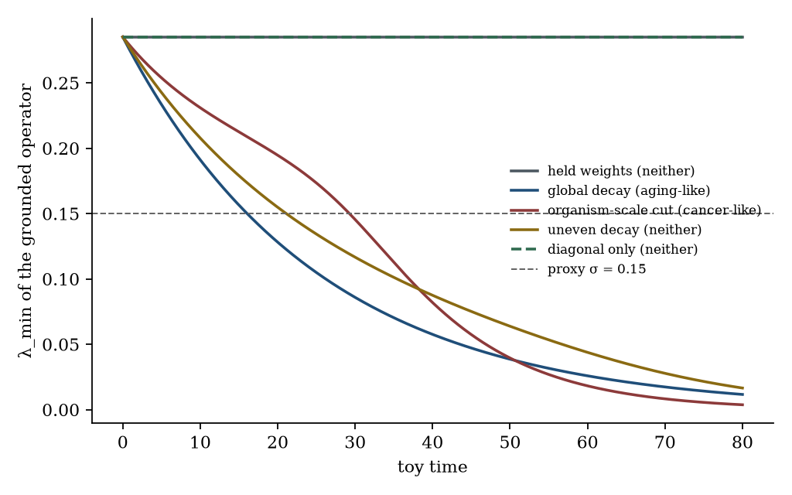
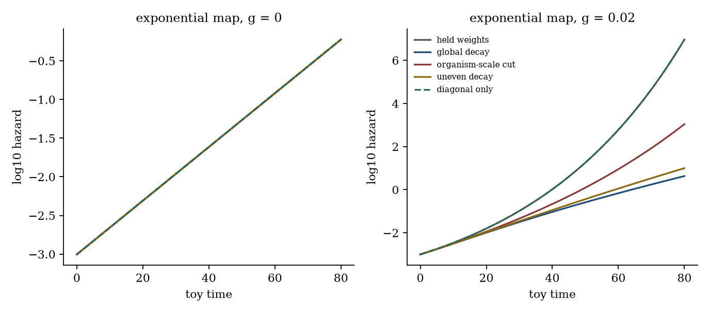
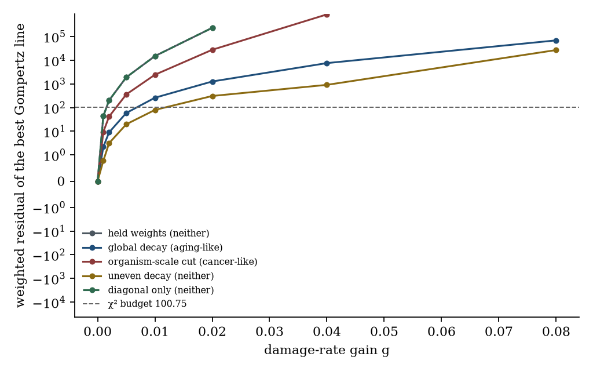
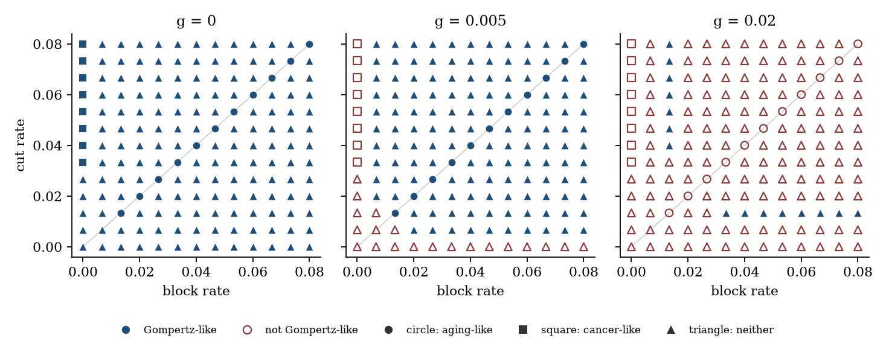

# Aging-like BAC sectors and load×gain Gompertz regimes on one shared subsystem toy

**Thesis #25. Computational research thesis**  
**Depends on:** Thesis #13 and Thesis #18  
**Author:** Kelechi Emeka Ogbonna  
**Correspondence:** kelechiogbonna300@gmail.com · https://github.com/cloudynirvana/thesis-25-bac-sectors-vs-gompertz-gain  
**Date:** 21 September 2026  
**Format:** B.Sc. project chapters (Nile University style), written as a computational methods manuscript  
**Status:** A joint reading of two declared objects on one five-index toy, plus a seeded numerical check. Not a measurement of aging.  
**Citation style:** numbered Vancouver. A `doi:` field appears only where Crossref returned the record.  
**DOI:** none for this document. Do not invent one.

---

## Title page

**AGING-LIKE BAC SECTORS AND LOAD×GAIN GOMPERTZ REGIMES ON ONE SHARED SUBSYSTEM TOY**

BY

**KELECHI EMEKA OGBONNA**

A COMPUTATIONAL RESEARCH THESIS  
(IN-SILICO JOINT READING OF A SECTOR CLASSIFIER AND A HAZARD RESIDUAL)

SUBMITTED AS A CITEABLE MANUSCRIPT FOR JOURNAL / THESIS HANDOFF

PROJECT CONFLUENCE  
INDEPENDENT COMPUTATIONAL RESEARCH

SUPERVISOR: not appointed for this deposit

SEPTEMBER 2026

---

## Declaration

I, Kelechi Emeka Ogbonna, declare that this computational research thesis was carried out by me. The sector labels, hazard residuals, and coincidence counts reported here were produced by `sim/joint_toy.py` at seed 20260921. The seed governs two hundred monotonicity draws. The hazard grid is deterministic. The numbers are not wet-lab measurements and not patient outcomes. No DOI, ORCID, or journal acceptance was invented for this document. No residual was copied from Thesis #13, and no eigenvalue was copied from Thesis #18.

_________________________     _______________________  
Kelechi Emeka Ogbonna         Date

---

## Abstract

On one shared subsystem toy, do aging-like Bounded Adaptive Coherence sectors coincide with load×gain regimes that produce Gompertz-like hazard, or do the two objects carve different regions?

They carve different regions. The shared object is a five-index weight matrix. Thesis #18 classes a path of that matrix by the terminal ratios of a grounded Laplacian eigenvalue and of two edge means. Thesis #13 classes a hazard by the weighted residual of log hazard against a straight line. This deposit runs both readings on the same paths. The damage-rate gain multiplies the same weights. The hazard-map gain multiplies the mean load.

At damage-rate gain zero, local damage is exactly linear on every path. The exponential map is an exact Gompertz hazard: the weighted residual rounds to 0 at six decimals, and the slope is 0.0800 per toy year (doubling time 8.664 toy years). The sector classifier still returns one aging-like path, one cancer-like path, and three paths classed neither. Gompertz-like hazard at this gain is the whole set of classes. The aging-like sector is one class inside it. The same linear damage, passed through an additive map that matches the exponential hazard at the two endpoints, has weighted residual 9354. That is above the χ² budget of 100.75 on 79 degrees of freedom, on every class, including the aging-like path.

At damage-rate gain 0.01 the split reverses on two named paths. Global decay, classed aging-like, has residual 260.9 and fails the budget. Uneven decay, classed neither, has residual 79.53 and passes. On a 13×13 grid of cut and block rates, at gain 0.02, the two sets are disjoint: all 11 aging-like nodes fail, and all 15 Gompertz-like nodes are classed neither. Raising the hazard-map gain from 8 to 16, at damage-rate gain 0.005, moves the aging-like residual from 59.18 to 236.7 and moves the call from pass to fail. The class does not move.

The slope 0.0800 is not the slope 0.0840 of Thesis #13. The budget 100.75 is not the budget 83.68 of that deposit. Both differences are consequences of the shared window and the five velocities declared here. No entropy production was computed. The names "aging-like" and "Gompertz-like" are labels on this toy.

Research only. Not a medical device, not a rejuvenation method, and not a cure.

---

## Keywords

bounded adaptive coherence; Gompertz hazard; load×gain coupling; grounded Laplacian; sector classifier; weighted residual; subsystem toy; research only

---

## Table of Contents

DECLARATION  
ABSTRACT  
Table of Contents  
List of tables and figures  

CHAPTER ONE. INTRODUCTION  
1.1 Background to the study  
1.2 STATEMENT OF RESEARCH PROBLEM  
1.3 JUSTIFICATION OF STUDY  
1.4 AIM AND OBJECTIVES OF THE STUDY  
1.5 SIGNIFICANCE OF THE STUDY  
1.6 SCOPE OF THE STUDY  

CHAPTER TWO. LITERATURE REVIEW  
2.1 A Gompertz shape is a property of a hazard  
2.2 A BAC sector is a property of a weight matrix  
2.3 The two sentences can be printed side by side  
2.4 What this deposit does not reopen  

CHAPTER THREE. MATERIALS AND METHODS  
3.1 Design, and a rule against repairing either object  
3.2 Weights, Laplacian, and the sector classifier  
3.3 Damage through the same weights, and two hazard maps  
3.4 The residual test  
3.5 Named paths, a rate plane, and a gain scan  
3.6 Propositions that fix the zero-gain case  
3.7 What was not done  

CHAPTER FOUR. RESULTS  
4.1 At zero damage-rate gain the hazard does not read the class  
4.2 The additive map fails on the aging-like path  
4.3 The named paths cross the budget at different gains  
4.4 On the rate plane the sets come apart  
4.5 The hazard-map gain moves the residual and leaves the class  
4.6 Checks  

CHAPTER FIVE. DISCUSSION, CONCLUSION AND RECOMMENDATION  
5.1 Discussion  
5.2 Conclusion  
5.3 Recommendation  

REFERENCES  
DISCLAIMER  

---

## List of tables and figures

**Table 3-1.** Initial symmetric weights.  
**Table 3-2.** Edge rates on the five named paths.  
**Table 3-3.** Classifier thresholds.  
**Table 3-4.** Node velocities and initial loads.  
**Table 3-5.** Scalar constants of the hazard.  
**Table 3-6.** Calls, fixed before the labels were read.  
**Table 4-1.** Class, margin crossing, and the two maps at gain zero.  
**Table 4-2.** Weighted Gompertz residual on the named paths.  
**Table 4-3.** Coincidence of the aging-like label and the Gompertz call.  
**Table 4-4.** The same coincidence on the rate plane.  
**Table 4-5.** Hazard-map gain on the aging-like path at damage-rate gain 0.005.

**Figure 4-1.** Grounded λ_min on the five paths, with the class in the legend.  
**Figure 4-2.** Log10 hazard on the same paths, at two damage-rate gains.  
**Figure 4-3.** Weighted residual against damage-rate gain.  
**Figure 4-4.** Sector label and Gompertz call on the rate plane.

Figures are diagnostics from `sim/joint_toy.py`. They are not measured networks and not life tables.

---

# CHAPTER ONE

## 1.0 INTRODUCTION

### 1.1 Background to the study

Aging and cancer are often placed in one review because both are failures of maintenance, and because two hallmark lists can be printed side by side [1–3]. A demographic curve is a different object from either list. Gompertz wrote a force of mortality that rises exponentially with age [4]. A computational deposit asks when a load×gain map of damaged subsystems produces a hazard of that shape, and which of the gains a public age schedule can see [5]. A second computational deposit asks whether a minimum eigenvalue of a coupling tensor can separate an aging-like global decay of weights from a cancer-like cut of the edges that touch one index [6]. The first object is a residual of log hazard. The second object is a sector of a weight matrix. They share a vocabulary of aging. They do not share a calculation.

Kirkwood's account of aging refuses a single programme that one would switch off [7]. That refusal is useful here because it blocks a shortcut. A label that contains the word aging is not yet a hazard, and a hazard that looks Gompertzian is not yet a sector of a coupling matrix. May's warning applies before either object is given a biological name: an equation borrowed from a neighbouring argument still has to be the equation the prose describes [8]. Saltelli and colleagues make the same demand of any model that might be mistaken for a decision [9].

The portfolio risk is concrete. If the two deposits are left side by side, a later reader can treat an aging-like sector and a Gompertz-like regime as two descriptions of one region. Nothing in the definitions forces that reading. The way to test it is to put both definitions on one toy and to count the paths that carry one label, the other, both, or neither.

### 1.2 STATEMENT OF RESEARCH PROBLEM

On one shared subsystem toy, do aging-like Bounded Adaptive Coherence sectors coincide with load×gain regimes that produce Gompertz-like hazard, or do the two objects carve different regions?

The working form is narrow. There are five indices and one nonnegative weight matrix, the matrix of Thesis #18 [6]. There is a sector classifier whose thresholds are those of that deposit. There is a damage equation whose coupling is the same matrix, and an exponential map of mean load, the load×gain map of Thesis #13 [5]. There is an additive map of the same load, used as the comparison that deposit used. There is a weighted residual of log hazard against a straight line, judged against the 95th percentile of a χ² law on the degrees of freedom of this window. The sets coincide on a declared grid if every aging-like point is Gompertz-like and every Gompertz-like point is aging-like. A single witness in either direction is enough to say they differ.

Collapse, if it happens, is a property of this toy and these two rules. It is not a statement about every model of aging [8]. A familiar way to miss the question is to treat the shared word "aging" as if it identified the sets before the counts are made.

### 1.3 JUSTIFICATION OF STUDY

Thesis #18 already records that a negative margin is not a sector label, and it leaves the Gompertz question in its own deposit [5,6]. Thesis #13 already records that an exponential map of a linear load is Gompertz-like and that an additive map of the same load is not, and it leaves the spectral margin alone. Each deposit is locally careful. The gap is the missing joint grid. Without it, the two aging stories can be read as one story.

The study is justified as a comparison of two functionals of one path. The classifier reads terminal ratios of weights and of one eigenvalue. The residual reads the shape of log hazard along the path. A parameter that enters only the second functional, such as the hazard-map gain, cannot be recovered from the first. A parameter that rearranges edges without being the condition the classifier names can still move the residual. Those are reasons to compute the four cells of a contingency table [8,9].

The study is not justified as a device, a rejuvenation protocol, or a claim that a row name is a treated cohort [9]. It is not a re-estimation of the six-node residuals in Thesis #13, and it does not replace the propositions about the Laplacian in Thesis #18.

### 1.4 AIM AND OBJECTIVES OF THE STUDY

The aim is to decide, on the toy in Chapter Three, whether the aging-like sector and the Gompertz-like load×gain regime are the same set.

The objectives are:

1. Restate the grounded operator and the sector classifier of Thesis #18, and recompute them on the shared horizon.
2. Drive a damage equation with those same weights, and score the exponential load×gain map with the residual rule of Thesis #13.
3. Score the endpoint-matched additive map on the same damage, as a comparison that holds the sector fixed and changes the map.
4. Report the four coincidence cells on the five named paths and on a predeclared rate plane.
5. Vary the hazard-map gain at fixed weights, and record whether the class moves when the residual moves.

Non-aims. Re-deriving the profile likelihood of the hazard-map gain [5]. Estimating entropy production. Fitting a downloaded life table. Ranking interventions. Reading a crossing of the spectral margin as a lifespan. Importing the numerical residuals of Thesis #13 as if this five-index window had produced them.

### 1.5 SIGNIFICANCE OF THE STUDY

The useful product is a pair of sets that can fail to match in public. If every aging-like path on the declared grid is Gompertz-like and every Gompertz-like path is aging-like, the coincidence claim holds on that grid. If either cell of the symmetric difference is nonempty, the claim fails on that grid, and the failure is a result about these two objects [8,9].

There is a second product inside the same script. The spectral margin can change sign on a path whose hazard is an exact Gompertz line, and it can stay positive on a path whose hazard has already left the χ² budget. That split keeps a crossing time from being promoted into a mortality slope.

What the significance is not: a rejuvenation mechanism, a reason to treat a row of the toy as a tissue, or a replacement for either parent deposit [1–3,5,6].

### 1.6 SCOPE OF THE STUDY

In scope. The linear algebra of the 5×5 weight matrix on toy time 0 to 80. Five named weight paths. A 13×13 grid of cut and block rates. A damage-rate gain on the list used by Thesis #13. One hazard-map gain, and a five-point scan of that gain. An exponential map and an endpoint-matched additive map. The χ² residual on 81 annual nodes. Two hundred monotonicity draws at seed 20260921.

Out of scope. Measured entropy production. Human or animal data. A download of the Human Mortality Database. Drug inputs, reprogramming factors, and senescent-cell clearance. A stochastic failure process and a mortality plateau. Any identification of the five index names with assays. A dose.

---

# CHAPTER TWO

## 2.0 LITERATURE REVIEW

### 2.1 A Gompertz shape is a property of a hazard

Gompertz's 1825 letter is a statement about the force of mortality in a life-contingency calculation [4]. Modern biodemography has used the exponential as a compact description of adult human mortality and has also documented where it bends [10,11]. Comparative schedules show species whose mortality does not rise in that way [12]. A model that emits a straight line on a log-hazard plot is reproducing one pattern, under one window. It is not a biological identity.

The disposable-soma account is an evolutionary argument about allocation [13]. Kirkwood's later essay is the same restraint: aging is not a single target with a single coefficient [7]. Strehler and Mildvan connected a linear decline in a vitality reserve to an exponential hazard by putting the reserve in an exponent [14]. The exponential map in Section 3.3 is in that family. It is not their physiological model. Cohen and colleagues ask aging biology to treat interacting systems as the object of study [15]. The present object is a five-index deterministic graph with an explicit observation map. It is one way of making that request numerical. It is not a review of the biology.

Network constructions already turn many parts into a Gompertz curve, by routes this thesis does not resimulate. Deficit networks and frailty indices treat mortality as a property of an accumulating graph [16–19]. Reliability arguments obtain a Gompertz-like failure from redundant elements that are used up [20]. Damage on an interdependent network is a different generator [21]. Binary subsystem failures, with each failure raising the chance of others, can make a population hazard look Gompertzian [22]. A deficit network under a mean-field assumption can do the same, and the derivation says where it stops being accurate [23]. A queue whose repair declines linearly with age can do it as well [24]. Those papers are related mechanisms. Their clinical or biological discussions are not results of this thesis.

A preprint has put a related split into prose: primary lesions as a damage load, and a systemic communication architecture as a gain that turns a slow input into late-life acceleration [25]. The same preprint argues for interventions whose time scale would be hard to explain by slow repair alone. Those interventional sentences are not hypotheses of this study. The calculation contains no reset term and no reversal experiment. The word "gain" below means the scalar γ in the hazard, or the scalar g in the damage rates.

Thesis #13 isolates the split as an identifiability question on six abstract nodes [5]. Local damage is linear when the damage-rate gain is zero. An exponential map of mean load is then an exact Gompertz hazard, with slope 0.0840 per model year on that deposit's velocities. An additive map matched at the endpoints is not Gompertz-like on that deposit's window. The present thesis uses the rule, which is a comparison of a weighted residual with a χ² percentile, and it does not use the six-node output. The velocities here are five numbers, declared in Table 3-4. The slope they produce at gain zero is computed in Chapter Four. A national life table was not downloaded [26].

### 2.2 A BAC sector is a property of a weight matrix

Fiedler defined the algebraic connectivity of a graph as the second-smallest eigenvalue of its Laplacian, and showed that it is positive exactly when the graph is connected [27]. Merris surveys the Laplacian and the quadratic form that makes monotonicity in the edge weights easy to see [28]. For a Laplacian the smallest eigenvalue is zero on a connected graph. The informative end of a grounded principal submatrix can be positive while the graph remains connected [27,28]. Thesis #18 takes that grounded eigenvalue as the spectral half of a bounded-adaptive-coherence comparison, after showing that the literal minimum eigenvalue of a raw nonnegative matrix moves the wrong way as coupling strengthens [6].

The sector half of that deposit is a classifier. Global decay of every off-diagonal weight, with the ratio of block mean to cut mean held near 1, is classed aging-like. Decay confined to the edges that touch the organism index, with the block mean held, is classed cancer-like. Uneven decay, diagonal-only decay, and a held matrix are classed neither. The thresholds are round numbers, fixed in the script. A negative margin against a declared proxy is not one of the columns. The cancer literature that motivates the cut — clonal evolution inside a soma, a hallmark list, a robustness argument — does not measure an edge between an "organism index" and a "cellular index" [29–32]. Noble's biological relativity is why a directed coupling can be stored at all, and also why the Laplacian's use of the symmetric part has to be confessed [33]. This thesis inherits the symmetric weights and the classifier. It does not reopen the directed surplus.

Entropy production is not computed. Seifert's review places that quantity inside a specified Markov process [34]. The constant 0.15 used as a proxy in Thesis #18 remains a proxy here. It is used only to recompute a crossing time, so that a reader can see the crossing beside the hazard call. It does not enter the classifier and it does not enter the residual.

### 2.3 The two sentences can be printed side by side

The sentence "aging-like global coupling decay" and the sentence "Gompertz-like hazard from load×gain" can be placed in one paragraph without either sentence implying the other [4–6]. Global decay multiplies every weight by a common factor. A row-rescaled coupling would ignore that factor. The damage equation in Section 3.3 does not row-rescale. It multiplies the damage-rate gain by the weights themselves, so a common decay attenuates the gain over toy time. That attenuation can move a residual. It is still not the predicate the classifier evaluates. The classifier asks whether the two edge means fell together. The residual asks whether log hazard stayed inside a linear band. A path can satisfy either predicate, both, or neither. Chapter Four counts those four outcomes.

The hazard-map gain is a second, sharper separation. It scales the load inside the exponent and does not appear in the weight matrix. Any change in the Gompertz call that is produced by changing only that gain is a change the sector classifier cannot see. The scan in Section 3.5 is there to make that independence numerical.

### 2.4 What this deposit does not reopen

Raue and colleagues use the profile likelihood when a coordinate is only partly seen by the data [35]. Thesis #13 applies that tool to the hazard-map gain and finds the gain free on a hazard-only schedule, once load velocity can compensate it [5]. This deposit does not recompute a profile, a Fisher rank, or a Cramér–Rao sketch. The question here is whether two labels mark the same region. A free gain is relevant only because it is a coordinate the sector label does not read. The numerical freedom of γ on a demographic schedule stays in Thesis #13.

A plateau of human mortality at the oldest ages is outside the generator [11]. Species that do not follow Gompertz are outside it as well [12]. Five deterministic indices are not a physiology [1,15].

---

# CHAPTER THREE

## 3.0 MATERIALS AND METHODS

### 3.1 Design, and a rule against repairing either object

The generator is fixed. Seed 20260921 governs two hundred random edge lifts used to check monotonicity of the grounded eigenvalue. The weight paths and the hazard grid are deterministic. Software is `sim/joint_toy.py`. Eigenpairs use the symmetric QR routine in NumPy. Damage trajectories use an explicit Runge–Kutta method of order 8 (DOP853), with relative tolerance 10−8 and absolute tolerance 10−10, except at zero damage-rate gain, where the damage is the closed form in Section 3.6.

The index set has five elements, in the order used by Thesis #18: molecular, cellular, tissue, organism, evolutionary [6]. These words are row names. They are not assays [1,8]. The organism index is row 3. The ground index, the row deleted to form the grounded operator, is row 4. The cut is the set of undirected edges with one end at row 3. The block is the other six undirected edges.

Toy time runs from 0 to 80. The sector classifier and the margin crossing use 801 uniformly spaced nodes, step 0.1, which is the grid of Thesis #18. The residual test uses the 81 annual nodes t = 0, 1, …, 80. Both grids are samples of the same exponential weight path. The class depends only on the endpoints, and the script checks that the annual endpoints return the same class as the fine grid.

One revision rule is imposed on both objects. The index set, the ground, the cut, the classifier thresholds, the χ² level, the near-linear cuts, the damage-rate list, and the hazard-map factors may not be changed in order to empty a coincidence cell or to fill one. A path the classifier calls "neither" stays "neither". A residual above the budget stays above the budget. The rule is a constraint on model revision. It is not a biological axiom [9].

### 3.2 Weights, Laplacian, and the sector classifier

The initial symmetric weights are those of Thesis #18. Table 3-1 records them. The mean of the ten off-diagonal entries is 0.49. The cut mean at t = 0 is 0.5625. The block mean is 0.441667.

**Table 3-1.** Initial symmetric off-diagonal weights. Cut edges touch the organism index.

| Pair | W(0) | Sector |
| --- | ---: | --- |
| molecular–cellular | 0.80 | block |
| molecular–tissue | 0.35 | block |
| molecular–organism | 0.55 | cut |
| molecular–evolutionary | 0.20 | block |
| cellular–tissue | 0.75 | block |
| cellular–organism | 0.60 | cut |
| cellular–evolutionary | 0.25 | block |
| tissue–organism | 0.70 | cut |
| tissue–evolutionary | 0.30 | block |
| organism–evolutionary | 0.40 | cut |

The combinatorial Laplacian is L = diag(W1) − W, with the diagonal of W discarded. The grounded operator Γ is the principal submatrix obtained by deleting the evolutionary row and column. The criterion λ_min(Γ) is the smallest eigenvalue of Γ. It is not the smallest eigenvalue of the raw coupling matrix [6,27].

Each off-diagonal weight follows Wij(t) = Wij(0) exp(−δij t). Table 3-2 gives the rates on the five named paths. A zero rate is a held edge. The diagonal of a stored coupling matrix is not an input to L and not an input to the damage equation. The diagonal-only path is included so that a within-index decay can be seen to move neither object.

**Table 3-2.** Exponential rates on off-diagonal weights.

| Path | Cut edges | Block edges |
| --- | ---: | ---: |
| Held | 0 | 0 |
| Global decay | 0.04 | 0.04 |
| Organism-scale cut | 0.08 | 0 |
| Uneven decay | 0.06 | 0.02 |
| Diagonal only | 0 | 0 |

Write r_λ = λ_min(Γ(80)) / λ_min(Γ(0)), r_block for the block-mean ratio, r_cut for the cut-mean ratio, and s for the ratio of (block mean / cut mean) at 80 to the same quotient at 0.

**Table 3-3.** Thresholds, taken from Thesis #18 and fixed before the labels are read [6].

| Quantity | Aging-like requires | Cancer-like requires |
| --- | --- | --- |
| r_λ | &lt; 0.5 | &lt; 0.5 |
| r_block | &lt; 0.5 | &gt; 0.9 |
| r_cut | &lt; 0.5 | &lt; 0.25 |
| s | inside (2/3, 1.5) | &gt; 3 |

A path is classed aging-like when it meets the whole aging column, and cancer-like when it meets the whole cancer column. Otherwise it is classed neither. The two columns cannot both hold, because one asks for a block-mean ratio below 0.5 and the other asks for a ratio above 0.9. The words "aging-like" and "cancer-like" mean membership in these columns [1,6,9].

A constant proxy σ = 0.15 is subtracted from λ_min(Γ) only to locate a crossing time by linear interpolation on the fine grid. The crossing is not a class and not a hazard. For global decay the closed form is t_* = log(λ_min(Γ(0)) / 0.15) / 0.04, and the interpolate is required to match it.

### 3.3 Damage through the same weights, and two hazard maps

Node damage starts at the values in Table 3-4 and has the velocities in that table. The means are L0 = 0.20 and v̄ = 0.010. These five pairs are not the six pairs of Thesis #13 [5].

**Table 3-4.** Node values. Model units. Not fitted to an assay.

| Index | vi | Di,0 |
| --- | ---: | ---: |
| molecular | 0.010 | 0.20 |
| cellular | 0.012 | 0.18 |
| tissue | 0.009 | 0.22 |
| organism | 0.011 | 0.19 |
| evolutionary | 0.008 | 0.21 |

Let w̄0 = 0.49, the mean initial off-diagonal weight. The damage equation is

dDi/dt = vi + (g / 4) Σj≠i (Wij(t) / w̄0) Dj.

The sum is a weighted pull toward the other nodes, scaled so that a complete graph with every off-diagonal weight equal to w̄0 reduces to g times the mean of the others. That is the coupling shape of Thesis #13, written here on the heterogeneous weights of Table 3-1 [5]. The equation does not divide by the current degree. A common decay of every weight therefore attenuates g. It is visible to the hazard.

The mean load is L(t) = (1/5) Σi Di(t). The exponential map, called load×gain below, is

μ(t) = μb exp(γ L(t)),

with the constants in Table 3-5. On a linear load L(t) = L0 + v̄ t the log hazard is affine, with slope β = γ v̄.

**Table 3-5.** Scalar constants. The slope β is γ v̄ on the linear load. It is not an estimate from a life table, and it is not the slope of Thesis #13.

| Symbol | Role | Value |
| --- | --- | ---: |
| v̄ | Mean of vi | 0.010 |
| L0 | Mean of Di,0 | 0.20 |
| γ | Hazard-map gain, default | 8 |
| μb | Baseline factor | 2.0×10−4 |
| β | γ v̄ on the linear load | 0.0800 per toy year |
| doubling time | log(2) / β | 8.664 toy years |

The additive map uses the same damage. It is the straight line in μ that matches the exponential map of that damage at t = 0 and at t = 80. The comparison asks whether the bend requires the exponential. The log of the chord is computed with a stable log-sum-exp, so a large endpoint ratio does not overflow the residual.

### 3.4 The residual test

Exposure at toy time t is E(t) = max(2×105 exp(−0.035 t), 500). It is a shrinking risk set, declared in the script, not a census [26]. If deaths were Poisson with mean μ E, the delta method would give a standard deviation 1/√(μ E) for log μ. The study fixes that formula on the linear generator at γ = 8, and it uses the resulting σ(t) as the weight for every residual on every path. The budget does not move with g or with the weight path. Thesis #13 used the same convention so that a change in fit would not be confounded with a change in the noise model [5].

On this generator, σ(0) = 0.071045 and σ(80) = 0.011744.

Let n = 81 and let the degrees of freedom be n − 2 = 79. The weighted residual of the best line log μ = α + β t is compared with the 95th percentile of the χ² law on 79 degrees of freedom. That percentile, returned by the script, is 100.748619 and is written 100.75 below. A quadratic alternative supplies a likelihood ratio, compared with 3.841, the usual 95th percentile on one degree of freedom. The two calls are not the same call [5].

**Table 3-6.** Calls. Cuts were written into the script before the coincidence counts were read.

| Call | Rule |
| --- | --- |
| Gompertz-like | The path is inside the scoring window, and the weighted residual of the best log-linear hazard is at most 100.75 |
| Curvature detectable | Linear-versus-quadratic likelihood ratio above 3.841 |
| Near-linear damage | Every node has R² ≥ 0.995 against toy time, and the largest absolute linear residual is at most 0.02 of that node's fitted increment |
| Scoring window | Every log-hazard value lies in [−80, 80] |
| Sets equal | The aging-like set and the Gompertz-like set have an empty symmetric difference |

A path that leaves the scoring window is not Gompertz-like, and its residual is reported as unscored. It is not reported as a large finite residual. Near-linear damage is recorded beside the hazard call. It is not part of the coincidence definition. The coincidence definition uses the aging-like column and the Gompertz-like row only.

### 3.5 Named paths, a rate plane, and a gain scan

The damage-rate list is the list of Thesis #13: g ∈ {0, 0.001, 0.002, 0.005, 0.01, 0.02, 0.04, 0.08} [5]. Each named path is scored at each of these gains, under both maps, at γ = 8.

The rate plane takes cut rate and block rate on 13 equally spaced values from 0 to 0.08 inclusive, step 1/150. That is 169 nodes. The plane is scored at g ∈ {0, 0.005, 0.02}, under the exponential map only, at γ = 8. The equal-rate diagonal is drawn on the figure as a guide. It is not a fitted line. Aging-like membership on that diagonal still has to meet Table 3-3, so a small common rate stays outside the class.

The hazard-map scan uses factors {0.25, 0.5, 1, 2, 4} applied to γ = 8, hence γ ∈ {2, 4, 8, 16, 32}, at g ∈ {0, 0.005}, on the five named paths, exponential map only. Damage does not depend on γ. One damage trajectory is reused across the factors. The noise budget stays the budget of γ = 8.

### 3.6 Propositions that fix the zero-gain case

The following statements are propositions about the equations in this chapter. They are not theorems about organisms.

**Proposition 1.** If g = 0, then Di(t) = Di,0 + vi t for every weight path.

The coupling term is multiplied by g. The initial-value problem that remains is an independent linear advance of each node.

**Proposition 2.** If g = 0, the exponential map has log μ(t) = log μb + γ L0 + γ v̄ t on every weight path. The weighted residual of the best straight line is a round-off. The sector class does not enter the expression.

Proposition 1 gives L(t) = L0 + v̄ t. The exponential map then contributes only an intercept and a slope. A weighted least-squares line recovers that intercept and slope, up to floating-point error.

**Proposition 3.** The class in Table 3-3 is a function of W(0) and of the rate matrix. It does not depend on g, on γ, or on which hazard map is applied.

The four ratios are computed from λ_min(Γ) and from two edge means at t = 0 and t = 80. None of those quantities reads the damage state.

**Proposition 4.** If every off-diagonal rate equals δ, then λ_min(Γ(t)) = e−δ t λ_min(Γ(0)), and the matrix inside the damage equation is e−δ t times its initial value. The sector ratio s equals 1.

The Laplacian is linear in the weights, and every weight carries the same factor. The same factor multiplies every term of the sum in the damage equation. The two edge means fall by the same factor, so their ratio does not move.

**Proposition 5.** On the held path, the damage equation has constant coefficients. Its solution is the variation-of-constants formula with the matrix exponential of (g/4) A, where Aij = Wij(0) / w̄0 for i ≠ j and Aii = 0.

This is the linear system dD/dt = v + (g/4) A D. It is used as a check on the numerical integrator, not as a biological law.

### 3.7 What was not done

Entropy production was not computed [34]. No life table was fitted [26]. Binary failure, repair queues, and an old-age plateau were not simulated [11,22,24]. Profile likelihood was not recomputed [5,35]. The six-node generator of Thesis #13 was not rerun in order to paste its residuals into these tables. No drug, reprogramming factor, or senescent-cell rule is a term in W(t) or in the damage equation. The margin was not shown to be a Lyapunov function. Noise was not added to a hazard draw, so nothing is claimed about a sampling distribution of the residual.

---

# CHAPTER FOUR

## 4.0 RESULTS

### 4.1 At zero damage-rate gain the hazard does not read the class

At t = 0, before any path diverges,

λ_min(Γ) = 0.285102, &nbsp; λ2(L) = 1.413084, &nbsp; λ2(Lblock) = 0.990917.

These three numbers agree with the values printed for the same initial matrix in Thesis #18, to the six decimals stored here [6]. The agreement is a check that the operator was rebuilt, not a transfer of that deposit's later conclusions.

Table 4-1 gives the classes. Global decay is aging-like: r_λ = e−3.2 = 0.040762 and the sector ratio does not move. The organism-scale cut is cancer-like: the block mean stays at 0.441667, the cut mean is multiplied by e−6.4, and the sector-change statistic is 601.845. Uneven decay has sector change 24.533 and is classed neither. Held weights and diagonal-only decay are classed neither. The maximum absolute error between λ_min(Γ(t)) and 0.285102 e−0.04 t on the global path is 0 at the stored tolerance. The range of λ_min on the held path and on the diagonal-only path is 0.

The constant-proxy crossing on global decay is 16.055 by the three-decimal rounding used in Thesis #18. The closed form evaluates to 16.055304. The absolute difference between the interpolate and the closed form is 4.9×10−5. The organism-scale cut crosses at 29.259. Uneven decay crosses at 21.102. Held weights and the diagonal-only path do not cross. These three crossings agree with the three-decimal values in that deposit because the weight path and the proxy are the same objects, recomputed here [6].

By Proposition 1 the damage at g = 0 does not read the path. The maximum absolute gap among the five damage trajectories is 0, and the gap from the linear formula is 0. By Proposition 2 the exponential map is one line. The fitted slope is 0.0800 and the fitted intercept is −6.917193, which is log μb + γ L0. The weighted residual, stored at six decimals, is 0. The unrounded residual on each path is below 10−24. The likelihood ratio against a quadratic is at round-off and is not a curvature. Every path is Gompertz-like. One of them is aging-like.

The Gompertz set at g = 0 therefore contains the cancer-like path and the three paths classed neither. The aging-like set does not contain them. On the five named paths the coincidence counts are 1 path in both sets, 0 aging-like paths outside the Gompertz set, and 4 Gompertz-like paths outside the aging-like set. The sets are not equal. Figure 4-1 shows the five eigenvalue paths and their classes. Figure 4-2, left panel, shows the five log-hazard paths lying on one curve.

**Figure 4-1.** λ_min(Γ) against toy time. The dashed grey line is the proxy σ = 0.15. The diagonal-only path is drawn dashed and lies on the held path. The class in the legend is the classifier of Table 3-3. It is not a reading of the hazard.

### 4.2 The additive map fails on the aging-like path

The additive map is forced to meet the exponential hazard at t = 0 and at t = 80. At g = 0 that exponential hazard is the same curve on every path, so the chord is the same chord. The weighted residual is 9354.17. The likelihood ratio for a quadratic term is 5324.75. The quadratic coefficient on the log hazard is −4.84×10−4. The call is not Gompertz-like, on all five classes.

The aging-like path is included in that failure. Global decay at g = 0 is aging-like by Table 4-1 and is Gompertz-like under the exponential map. The same damage, read through the additive map, leaves the budget by almost two orders of magnitude. The sector label did not change between the two rows of the table. The map did. The coupling assumption that produces the Gompertz shape, at this gain, is the exponential map, as Thesis #13 found on a different generator [5]. The residual 9354 is not that deposit's residual 5776. The window, the weights, and the load are different, and the budget is 100.75 rather than 83.68.

**Table 4-1.** Class under Table 3-3, crossing of λ_min(Γ) through σ = 0.15, and the two maps at g = 0, γ = 8. Residuals are weighted sums of squares. "Yes" means Gompertz-like under Table 3-6.

| Path | Class | Crossing | Exponential residual | Additive residual |
| --- | --- | ---: | ---: | ---: |
| Held | neither | absent | ~0 (yes) | 9354 (no) |
| Global decay | aging-like | 16.055 | ~0 (yes) | 9354 (no) |
| Organism-scale cut | cancer-like | 29.259 | ~0 (yes) | 9354 (no) |
| Uneven decay | neither | 21.102 | ~0 (yes) | 9354 (no) |
| Diagonal only | neither | absent | ~0 (yes) | 9354 (no) |

The held path is the cleanest single witness that a Gompertz-like load×gain hazard does not require the aging-like sector. Its margin against σ = 0.15 stays at 0.135102 for the whole horizon, and its exponential residual is a round-off. The global-decay path is the matching witness in the other column of the same table once the map is changed: the sector is aging-like, and the additive residual is 9354.

### 4.3 The named paths cross the budget at different gains

Table 4-2 is the exponential map at γ = 8. The diagonal-only path is omitted from the table. Its off-diagonal weights are the held weights, and the maximum absolute gap between its log hazard and the held log hazard, over every scanned g and both maps, is 0. A falling within-index weight moves neither the class nor the hazard.

At g = 0.001 every named path remains Gompertz-like. The held residual is 44.01, inside 100.75, and the likelihood ratio for a quadratic term is also 44.01, above 3.841. Curvature is detectable on a path the omnibus call still accepts. The global-decay residual at the same gain is 2.191, and its likelihood ratio is 2.181, so the omnibus call passes and the curvature call does not. The two calls already disagree inside the aging-like path's neighbour, and they disagree with each other on the held path.

At g = 0.002 the held residual is 201.9 and the call fails. Global decay (8.935), the organism-scale cut (41.74), and uneven decay (3.123) still pass. At g = 0.005 the organism-scale cut fails (360.2) while global decay (59.18) and uneven decay (19.72) pass. At g = 0.01 global decay fails (260.9) and uneven decay still passes (79.53). At g = 0.02 every named path fails.

The cell that matters for the question is the pair at g = 0.01. Global decay is aging-like and is not Gompertz-like. Uneven decay is neither and is Gompertz-like. Both directions of the symmetric difference are nonempty on a grid that contains this single gain. The sets are not equal, and neither set contains the other.

Held weights and the diagonal-only path leave the scoring window at g = 0.04 and at g = 0.08. The organism-scale cut leaves it at g = 0.08. At g = 0.04 the held terminal load is 11.842, and log μ at γ = 8 then exceeds the cap of 80. Those cells are unscored. They are counted as not Gompertz-like because no scored line was accepted, and the residual itself is not invented. Global decay remains inside the window at both of those gains and fails the budget in both (residual 7591 at g = 0.04 and 6.940×104 at g = 0.08).

**Figure 4-2.** Log10 of the exponential hazard. Left: g = 0. The five paths coincide, as Proposition 2 requires. Right: g = 0.02. The paths separate. The diagonal-only curve is dashed and lies on the held curve. Toy time is not a calendar age.

**Figure 4-3.** Weighted residual of the best log-linear hazard. The dashed line is the budget 100.75. The vertical scale is linear near zero and logarithmic above 1. The diagonal-only curve is dashed and lies on the held curve. Unscored gains are omitted from the curve and are marked in Table 4-2.

**Table 4-2.** Weighted residual of the exponential map at γ = 8. "Yes" means the residual is at most 100.75. Diagonal-only decay matches the held column at every row.

| g | Held | Global decay | Organism-scale cut | Uneven decay |
| ---: | ---: | ---: | ---: | ---: |
| 0 | ~0 (yes) | ~0 (yes) | ~0 (yes) | ~0 (yes) |
| 0.001 | 44.01 (yes) | 2.191 (yes) | 9.363 (yes) | 0.777 (yes) |
| 0.002 | 201.9 (no) | 8.935 (yes) | 41.74 (yes) | 3.123 (yes) |
| 0.005 | 1903 (no) | 59.18 (yes) | 360.2 (no) | 19.72 (yes) |
| 0.01 | 1.505×104 (no) | 260.9 (no) | 2449 (no) | 79.53 (yes) |
| 0.02 | 2.355×105 (no) | 1270 (no) | 2.780×104 (no) | 309.4 (no) |
| 0.04 | unscored (no) | 7591 (no) | 8.681×105 (no) | 913.2 (no) |
| 0.08 | unscored (no) | 6.940×104 (no) | unscored (no) | 2.703×104 (no) |

Near-linear damage, under the cuts in Table 3-6, also fails to track the sector. At g = 0.01 global decay is still near-linear (minimum R² 0.9992, maximum relative residual 0.0174) and is not Gompertz-like. At g = 0.002 the held path is still near-linear (relative residual 0.0167) and is not Gompertz-like. A path can keep a nearly straight damage trajectory and still miss the hazard budget, because the residual test is the stricter of the two once γ = 8 amplifies a small bow. The coincidence question was asked of the hazard call. The near-linear call would not have rescued it.

Table 4-3 collects the named-path counts under the exponential map. At every listed gain the sets differ. The Jaccard index on these five paths moves from 1/5 at g = 0 to 0 at g = 0.01, where the intersection itself is empty.

**Table 4-3.** Aging-like label against the Gompertz call. Five named paths, exponential map, γ = 8. "Equal" asks whether the two sets are the same set.

| g | In both | Aging-like only | Gompertz-like only | Equal |
| ---: | ---: | ---: | ---: | --- |
| 0 | 1 | 0 | 4 | no |
| 0.001 | 1 | 0 | 4 | no |
| 0.002 | 1 | 0 | 2 | no |
| 0.005 | 1 | 0 | 1 | no |
| 0.01 | 0 | 1 | 1 | no |
| 0.02 | 0 | 1 | 0 | no |
| 0.04 | 0 | 1 | 0 | no |
| 0.08 | 0 | 1 | 0 | no |

### 4.4 On the rate plane the sets come apart

The plane has 169 nodes. The class does not depend on g, by Proposition 3, and the counts confirm it: 11 aging-like nodes, 8 cancer-like nodes, and 150 nodes classed neither, at each of the three gains. The aging-like nodes are the equal-rate diagonal from rate 0.01333 to rate 0.08. The common rate 0 and the common rate 0.006667 fall short of the ratio cut 0.5 and stay outside the class. The cancer-like nodes are the eight nodes with block rate 0 and cut rate from 0.03333 to 0.08. Every node on all three panels lies inside the scoring window.

At g = 0 every node is Gompertz-like, by Proposition 2. The aging-like set is 11 of the 169. The Jaccard index is 11/169. The 8 cancer-like nodes are Gompertz-like. A cancer-like sector is not an obstacle to an exact Gompertz line when the damage-rate gain is zero, because that gain is the only door through which the weights enter the hazard.

At g = 0.005 the 11 aging-like nodes all pass, with residuals from 9.3 to 59.2. The 8 cancer-like nodes all fail, with residuals from 319 to 360. Of the 150 nodes classed neither, 130 pass and 20 fail. The Gompertz set has 141 nodes. It contains the aging-like set and also contains 130 nodes the classifier refuses to call aging-like. It excludes the cancer-like set. The Jaccard index is 11/141. Containment of the aging-like set inside the Gompertz set is not equality.

At g = 0.02 the intersection is empty. All 11 aging-like nodes fail. The smallest residual on that diagonal is 161.8, at common rate 0.02, and the largest is 3063, at common rate 0.01333. All 8 cancer-like nodes fail, with residuals between 2.74×104 and 3.09×104. The 15 nodes that pass are classed neither. They sit off the equal-rate diagonal: one strip has cut rate 0.01333 and block rate from 0.03333 to 0.08, and the other has block rate 0.01333 and cut rate from 0.04 to 0.08. The Jaccard index is 0. Figure 4-4 shows the three panels. Filled markers pass the residual test. Open markers do not. Circles are aging-like, squares are cancer-like, and triangles are neither.

**Figure 4-4.** Cut rate against block rate. The grey line is the equal-rate diagonal, a guide, not a fit. Filled navy markers are Gompertz-like. Open maroon markers are not. Circles are aging-like, squares are cancer-like, triangles are neither. At g = 0.02 the circles are open and the filled markers are triangles.

**Table 4-4.** Coincidence on the 169-node plane. Exponential map, γ = 8. Every node was scored.

| g | Aging-like | Gompertz-like | In both | Aging-like only | Gompertz-like only | Jaccard |
| ---: | ---: | ---: | ---: | ---: | ---: | ---: |
| 0 | 11 | 169 | 11 | 0 | 158 | 11/169 |
| 0.005 | 11 | 141 | 11 | 0 | 130 | 11/141 |
| 0.02 | 11 | 15 | 0 | 11 | 15 | 0 |

The geometry has a reading that stays inside the equations. An aging-like node is a common rate large enough to drop both edge means by at least half, which forces the sector ratio to stay at 1. The damage equation then sees a gain g e−δ t in front of a fixed coupling shape. At g = 0.02 that attenuated gain is still large enough, on every such δ in the grid, to push the residual above 100.75. A node classed neither can decay one sector faster than the other. The classifier rejects it because s leaves the band (2/3, 1.5). The hazard can still land inside the budget, because the integrated coupling along that unbalanced path is smaller than the integrated coupling along the equal-rate path that the classifier accepts. The predicate "the two means fell together" and the predicate "log hazard stayed linear" select different nodes of the same square.

### 4.5 The hazard-map gain moves the residual and leaves the class

At g = 0, changing γ from 2 to 32 leaves every exponential residual at round-off. Proposition 2 scales the slope and does not create a bow. The class is unchanged, as Proposition 3 requires.

At g = 0.005 the global-decay path is aging-like at every factor. The residual scales by four when γ doubles, to the printed precision: 3.69855, 14.7942, 59.1768, 236.707, 946.829. That factor of four is the square of the gain ratio. The lack of fit in log hazard is γ times the lack of fit in the load, once an intercept and a slope have been removed, and the weighted sum of squares therefore carries γ². Table 4-5 records the calls. At γ = 2 the residual is 3.699 and the curvature ratio is 3.683, so the path is Gompertz-like and the curvature call does not fire. At γ = 4 and at γ = 8 the omnibus call still passes and the curvature call fires. At γ = 16 the residual is 236.7 and the omnibus call fails. The class at that row is still aging-like.

The hazard-map gain is the coefficient Thesis #13 called free on a hazard-only schedule [5]. Here it is not being identified. It is being used as a coordinate that the sector classifier cannot see. One aging-like path, one damage trajectory, and two values of γ are enough to put that path on both sides of the budget.

**Table 4-5.** Global decay at g = 0.005. The class is aging-like on every row. Residuals use the σ of the γ = 8 linear generator.

| γ | Residual | Quadratic ratio | Gompertz-like | Curvature detectable |
| ---: | ---: | ---: | --- | --- |
| 2 | 3.699 | 3.683 | yes | no |
| 4 | 14.79 | 14.73 | yes | yes |
| 8 | 59.18 | 58.93 | yes | yes |
| 16 | 236.7 | 235.7 | no | yes |
| 32 | 946.8 | 942.8 | no | yes |

### 4.6 Checks

Two hundred single-edge lifts of +0.05, drawn at seed 20260921, produced 0 decreases of λ_min(Γ), to a tolerance of 10−10. Fifty random vectors matched the Laplacian quadratic form with maximum absolute error 0. The global-decay scaling error is 0. The diagonal-only and held ranges of λ_min are 0. The five classes match the five predeclared labels, including "neither" for uneven decay.

On the held path at g = 0.02, the numerical damage and the matrix-exponential formula of Proposition 5 differ by at most 10−6 in absolute value. At g = 0 the five paths share one damage trajectory, and that trajectory matches D0 + v t. The exponential residual at g = 0 is below 10−24 before rounding and is stored as 0. The additive call at g = 0 fails on every path. The pooled named-path comparison under the exponential map is not an equality of sets, and the g = 0 plane is not an equality of sets. Both of those inequalities are the content of Proposition 2 together with Table 3-3: every node is Gompertz-like, and not every node is aging-like. They are regression checks on that identity. The Jaccard indices at g = 0.005 and at g = 0.02 are not inside the abort condition. The script would still have written them if the intersection at g = 0.02 had been nonempty. It was empty.

The class labels on the γ scan match the labels of the underlying weight paths. The script raises if any of these checks fail. This run did not raise.

---

# CHAPTER FIVE

## 5.0 DISCUSSION, CONCLUSION AND RECOMMENDATION

### 5.1 Discussion

The question in Section 1.2 has a direct answer on this toy. The two objects carve different regions. The answer does not depend on a single panel. At g = 0 the Gompertz set is the entire grid and the aging-like set is a subset: 1 of 5 named paths, and 11 of 169 plane nodes. At g = 0.01 the named-path intersection is empty, with the aging-like path on the failing side and a path classed neither on the passing side. At g = 0.02 the plane intersection is empty, with 11 aging-like failures and 15 Gompertz-like nodes that the classifier calls neither. At fixed g = 0.005, moving γ from 8 to 16 carries the aging-like path across the budget and leaves the class where it was.

Each of those facts has a short algebraic parent. Proposition 2 is the parent of the g = 0 panel: the weights are multiplied by a gain that has been set to zero, so the hazard cannot know which sector is decaying. Proposition 3 is the parent of the γ scan: the class is a function of the rate matrix. Proposition 4 is the parent of the diagonal on the plane: a common rate is exactly the motion the aging-like column was written to recognise, and it is also a pure attenuation of g, which is a different predicate from "the residual is below 100.75". The unbalanced nodes that pass at g = 0.02 are the numerical form of that difference. They fail the sector band and pass the line.

The order in which the named paths leave the budget blocks a second slogan. Held weights fail first, at g = 0.002. The organism-scale cut fails at g = 0.005. Global decay fails at g = 0.01. Uneven decay fails at g = 0.02. The aging-like path is not the first to leave and not the last. "Aging-like" in this script is not "the gain at which the hazard becomes Gompertzian" and not "the gain at which it stops". Anyone who wants either slogan needs a different functional, declared before the curves are drawn [8,9].

The margin crossings block a third slogan. Global decay crosses σ = 0.15 at toy time 16.055 and, at g = 0, is an exact Gompertz hazard. Held weights never cross, and at g = 0.002 they have already failed the residual test. A crossing of λ_min(Γ) is not a Gompertz slope. A Gompertz slope is not a crossing. Thesis #18 asked that a negative margin not be promoted into a sector label [6]. The tables here add the neighbouring refusal: a sector label is not a hazard call, and a hazard call is not a margin.

The additive row is the refusal that belongs to Thesis #13, repeated on a path this classifier calls aging-like [5]. Residual 9354 against budget 100.75, on damage that is exactly linear, means that the shape came from the exponential map. It did not come from the global decay of the weights. Those weights are decaying on that path, and at g = 0 the decay is invisible to the damage. Reporting the path as Gompertz-like because it is aging-like would have erased the map.

The numbers that must not be borrowed are specific. Thesis #13's linear slope is 0.0840 per model year because its mean velocity is 0.0105. The slope here is 0.0800 because the mean of Table 3-4 is 0.010. The doubling time is 8.664 toy years, not 8.25. The χ² budget is 100.75 on 79 degrees of freedom because the shared horizon has 81 annual nodes, not 66 ages and 64 degrees of freedom. The additive residual is 9354, not 5776. Using either deposit's printed residual as a result of this script would be a false citation [5,6].

The fixed noise budget is a limitation with a known direction. σ was taken from the linear generator, so a path whose hazard is larger than that generator is scored with weights that are wider than a Poisson model of its own μ would have allowed. Wider weights shrink the residual. The failure of global decay at g = 0.01, residual 260.9, is therefore not an artefact of an overly tight budget. A budget rebuilt from that path's own μ would have been tighter. The same remark applies to the empty intersection at g = 0.02.

Further limitations, kept specific:

- Five indices and Table 3-1 are a choice. A different connected W(0) would change the initial eigenvalue and the coupling operator A. It would not reverse Proposition 2, which does not use the entries of W.
- The 13×13 plane is a grid, not a certificate about every real pair (δ_cut, δ_block). The named paths are the five schedules of Thesis #18, not a sample from a prior.
- Exponential weights are the paths on which Proposition 4 is exact. A state-dependent repair function is a different model and was not studied.
- The cap of 80 on log hazard is a numerical window. The unscored cells at high g are failures to remain a scored Gompertz hazard. They are not finite residuals.
- The classifier thresholds are the round numbers of Thesis #18. On the named paths the sector statistics sit far from the boundaries: s is 1, or 601.845, or 24.533.
- There is no noise model on the residual, so there is no confidence interval for a borderline cell. The witnesses used in the conclusion are not borderline: 0 against 100.75, 79.53 against 260.9, and an empty intersection.
- The class names and the word "Gompertz-like" are labels. They are not clinical findings and not national rates [4,9,10,26].

The row names remain a temptation. A hallmark, a frailty index, and a clonal-evolution narrative are measurements with their own literatures [1,16,30,31]. Writing any of those words on a row of Table 3-1 does not convert either label into one of those measurements. The interventional reading of a load×gain split is not a term in the damage equation [25].

### 5.2 Conclusion

On one shared subsystem toy, do aging-like Bounded Adaptive Coherence sectors coincide with load×gain regimes that produce Gompertz-like hazard, or do the two objects carve different regions?

They carve different regions. On every declared grid in Chapter Four the aging-like set and the Gompertz-like set differ.

1. At g = 0 the exponential map is an exact Gompertz hazard on every weight path. The stored residual is 0, the slope is 0.0800 per toy year, and the doubling time is 8.664 toy years. The classifier returns aging-like only for global decay. The other four named paths, including the cancer-like cut, are Gompertz-like and are not aging-like. On the 169-node plane the Jaccard index is 11/169.
2. The additive map of that same linear damage has residual 9354.17 on every class, including the aging-like path. The exponential map, not the sector, produces the line.
3. At g = 0.01, global decay is aging-like and has residual 260.9. Uneven decay is classed neither and has residual 79.53. The intersection of the two sets, on the five named paths, is empty.
4. At g = 0.02 the plane intersection is empty. All 11 aging-like nodes fail. The 15 nodes that pass are classed neither. All 8 cancer-like nodes fail. The Jaccard index is 0.
5. On global decay at g = 0.005, the residual is 59.18 at γ = 8 and 236.7 at γ = 16. The first call passes and the second fails. The class is aging-like on both rows. The residual scales by four when γ doubles.
6. Held weights fail the budget at a smaller g than global decay does (g = 0.002 against g = 0.01). The aging-like path is not the boundary of the Gompertz regime.
7. The initial grounded eigenvalue 0.285102, the classes, and the constant-proxy crossings 16.055, 29.259, and 21.102 agree with the corresponding printed values of Thesis #18 because the weight path was rebuilt. The slope, the budget, and the residuals do not agree with Thesis #13, and they should not: the generator is not that generator [5,6].
8. The numbers above are properties of `sim/joint_toy.py` at seed 20260921. They are not measurements of aging, not lifespans, and not a rejuvenation result [8,9].

### 5.3 Recommendation

1. When an aging-like sector and a Gompertz-like hazard are mentioned in one argument, state the grid on which their equality was checked. On the grids of this deposit the equality fails.
2. Keep the exponential map and the additive map as separate rows. A sector label does not choose the map [5].
3. Keep the omnibus residual and the quadratic likelihood ratio as separate calls. State the budget and the degrees of freedom. The budget here is 100.75 on 79 degrees of freedom, not the budget of a 66-age window.
4. Publish the cut set, the ground index, and the classifier thresholds in the same note as the curves. The ground used here is the evolutionary index, as in Thesis #18 [6].
5. If a coordinate such as γ moves the residual and does not appear in the weight matrix, do not infer that coordinate from the sector label.
6. Cite the numerical output of Thesis #13 and of Thesis #18 only for the generators those deposits actually ran. Recompute a joint claim on the joint toy.
7. Leave dosing, rejuvenation protocols, device claims, and clinical decision rules outside papers of this type [9,25].
8. A document DOI, if one is minted later, belongs in `CITATION.cff` only after it exists.

---

## REFERENCES

Journal items use Vancouver form. DOI strings are those returned by Crossref for the cited version. The Zenodo item is not a Crossref record; the URL was resolved as published in Thesis #13. Internet items have no `doi:` field. This document has no DOI.

1. López-Otín C, Blasco MA, Partridge L, Serrano M, Kroemer G. The hallmarks of aging. Cell. 2013;153(6):1194-1217. doi:10.1016/j.cell.2013.05.039.
2. López-Otín C, Blasco MA, Partridge L, Serrano M, Kroemer G. Hallmarks of aging: an expanding universe. Cell. 2023;186(2):243-278. doi:10.1016/j.cell.2022.11.001.
3. López-Otín C, Pietrocola F, Roiz-Valle D, Galluzzi L, Kroemer G. Meta-hallmarks of aging and cancer. Cell Metab. 2023;35(1):12-35. doi:10.1016/j.cmet.2022.11.001.
4. Gompertz B. On the nature of the function expressive of the law of human mortality, and on a new mode of determining the value of life contingencies. Philos Trans R Soc Lond. 1825;115:513-583. doi:10.1098/rstl.1825.0026.
5. Ogbonna KE. Gompertz-like hazard from load×gain coupling of damaged subsystems: a computational biogerontology object [Internet]. Thesis #13 computational research thesis. 2026 [cited 2026 Sep 21]. Available from: https://github.com/cloudynirvana/thesis-13-gompertz-load-gain-coupling
6. Ogbonna KE. Bounded adaptive coherence: a coupling-tensor λ_min criterion as a computational object for aging-versus-cancer failure modes [Internet]. Thesis #18 computational research thesis. 2026 [cited 2026 Sep 21]. Available from: https://github.com/cloudynirvana/thesis-18-bounded-adaptive-coherence
7. Kirkwood TBL. Understanding the odd science of aging. Cell. 2005;120(4):437-447. doi:10.1016/j.cell.2005.01.027.
8. May RM. Uses and abuses of mathematics in biology. Science. 2004;303(5659):790-793. doi:10.1126/science.1094442.
9. Saltelli A, Bammer G, Bruno I, Charters E, Di Fiore M, Didier E, et al. Five ways to ensure that models serve society: a manifesto. Nature. 2020;582(7813):482-484. doi:10.1038/d41586-020-01812-9.
10. Vaupel JW. Biodemography of human ageing. Nature. 2010;464(7288):536-542. doi:10.1038/nature08984.
11. Barbi E, Lagona F, Marsili M, Vaupel JW, Wachter KW. The plateau of human mortality: demography of longevity pioneers. Science. 2018;360(6396):1459-1461. doi:10.1126/science.aat3119.
12. Jones OR, Scheuerlein A, Salguero-Gómez R, Camarda CG, Schaible R, Casper BB, et al. Diversity of ageing across the tree of life. Nature. 2014;505(7482):169-173. doi:10.1038/nature12789.
13. Kirkwood TBL. Evolution of ageing. Nature. 1977;270(5635):301-304. doi:10.1038/270301a0.
14. Strehler BL, Mildvan AS. General theory of mortality and aging. Science. 1960;132(3418):14-21. doi:10.1126/science.132.3418.14.
15. Cohen AA, Ferrucci L, Fülöp T, Gravel D, Hao N, Kriete A, et al. A complex systems approach to aging biology. Nat Aging. 2022;2(7):580-591. doi:10.1038/s43587-022-00252-6.
16. Mitnitski AB, Rutenberg AD, Farrell S, Rockwood K. Aging, frailty and complex networks. Biogerontology. 2017;18(4):433-446. doi:10.1007/s10522-017-9684-x.
17. Taneja S, Mitnitski AB, Rockwood K, Rutenberg AD. Dynamical network model for age-related health deficits and mortality. Phys Rev E. 2016;93(2):022309. doi:10.1103/physreve.93.022309.
18. Rutenberg AD, Mitnitski AB, Farrell SG, Rockwood K. Unifying aging and frailty through complex dynamical networks. Exp Gerontol. 2018;107:126-129. doi:10.1016/j.exger.2017.08.027.
19. Farrell SG, Mitnitski AB, Rockwood K, Rutenberg AD. Network model of human aging: frailty limits and information measures. Phys Rev E. 2016;94(5):052409. doi:10.1103/physreve.94.052409.
20. Gavrilov LA, Gavrilova NS. The reliability theory of aging and longevity. J Theor Biol. 2001;213(4):527-545. doi:10.1006/jtbi.2001.2430.
21. Vural DC, Morrison G, Mahadevan L. Aging in complex interdependency networks. Phys Rev E. 2014;89(2):022811. doi:10.1103/physreve.89.022811.
22. Nielsen PY, Jensen MK, Mitarai N, Bhatt S. The Gompertz law emerges naturally from the inter-dependencies between sub-components in complex organisms. Sci Rep. 2024;14(1):1196. doi:10.1038/s41598-024-51669-5.
23. Flietner V, Heidergott B, den Hollander F, Lindner I, Parvaneh A, Strulik H. A unifying theory of aging and mortality. Sci Rep. 2025;15(1):28766. doi:10.1038/s41598-025-11454-4.
24. Ledberg A. Exponential increase in mortality with age is a generic property of a simple model system of damage accumulation and death. PLoS One. 2020;15(6):e0233384. doi:10.1371/journal.pone.0233384.
25. Sottas PE. From damage accumulation to systemic amplification: reframing the logic of late-life rejuvenation [preprint]. Zenodo; 2026 [cited 2026 Sep 21]. Available from: https://doi.org/10.5281/zenodo.20007684
26. Barbieri M, Wilmoth JR, Shkolnikov VM, Glei DA, Jasilionis D, Jdanov D, et al. Data resource profile: the Human Mortality Database (HMD). Int J Epidemiol. 2015;44(5):1549-1556. doi:10.1093/ije/dyv105.
27. Fiedler M. Algebraic connectivity of graphs. Czech Math J. 1973;23(2):298-305. doi:10.21136/cmj.1973.101168.
28. Merris R. Laplacian matrices of graphs: a survey. Linear Algebra Appl. 1994;197-198:143-176. doi:10.1016/0024-3795(94)90486-3.
29. Hanahan D, Weinberg RA. Hallmarks of cancer: the next generation. Cell. 2011;144(5):646-674. doi:10.1016/j.cell.2011.02.013.
30. Nowell PC. The clonal evolution of tumor cell populations. Science. 1976;194(4260):23-28. doi:10.1126/science.959840.
31. Greaves M, Maley CC. Clonal evolution in cancer. Nature. 2012;481(7381):306-313. doi:10.1038/nature10762.
32. Kitano H. Biological robustness. Nat Rev Genet. 2004;5(11):826-837. doi:10.1038/nrg1471.
33. Noble D. A theory of biological relativity: no privileged level of causation. Interface Focus. 2012;2(1):55-64. doi:10.1098/rsfs.2011.0067.
34. Seifert U. Stochastic thermodynamics, fluctuation theorems and molecular machines. Rep Prog Phys. 2012;75(12):126001. doi:10.1088/0034-4885/75/12/126001.
35. Raue A, Kreutz C, Maiwald T, Bachmann J, Schilling M, Klingmüller U, et al. Structural and practical identifiability analysis of partially observed dynamical models by exploiting the profile likelihood. Bioinformatics. 2009;25(15):1923-1929. doi:10.1093/bioinformatics/btp358.

---

## Disclaimer

Research manuscript. Not a medical device, not clinical decision support, not a diagnostic or therapeutic product, not a rejuvenation method, and not a protocol [9]. Eigenvalues, sector labels, and hazard residuals are properties of the toy generator. They are not patient outcomes and not national mortality rates. No document DOI is registered.

Deposit: https://github.com/cloudynirvana/thesis-25-bac-sectors-vs-gompertz-gain
